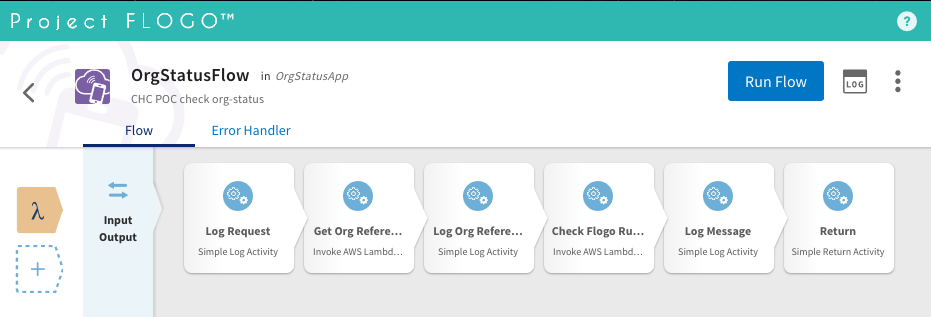

# flogo-org-status-app

This is a lambda function visually modeled in Flogo, and then generated and deployed to AWS using flogo-cli.  Flogo is an ultra-light, Go-based open source ecosystem for building event-driven apps.  More details about Flogo can be found [here](http://www.flogo.io/).  This lambda function implements the org-status validation services, which fetches org-status from Redis cache, and then invokes Flogo-rules to validate the org-status. Refer `test.sh` for examples about how to invoke this function.

```bash
.
├── README.md                     <-- This instructions file
└── deploy.sh                     <-- Script to build and deploy the lambda to AWS
└── env.sh                        <-- Connection info of the deployed lambda function
└── org_status_app-template.json  <-- Flogo flow exported from Flogo UI
└── test.sh                       <-- Test for lambda function
```

## Flogo Flow

The org-status flow is a simple flow that calls 2 lambda functions sequentially and logs status at each step.  It first calls the `org-reference-app` to fetch org-status data from Redis, and it then feed the org-status data to `flogo-rules-app` to validate the org-status, and finally it returns the result of the evaluation of flogo rules.
