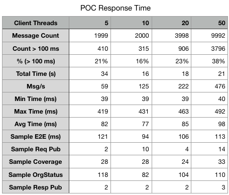

# Benchmark Eligibility Request
This is a driver for testing the response time of eligibility orchestrator.

## Build and run benchmark test
```bash
make build
./test.sh
```
The test script uses `ssh` to run test on the bastion host, although you may also run the test from you local PC, e.g., for mac,
```bash
./perf-mac -debug
```
Or print out more info about how to use the performance test driver.
```bash
./perf-mac -help
```

## Performance Test Result


This result shows that average response time of this service is 77-98 ms. The system scales linearly as the test driver increases message rate by using more threads.  Thus it can process at a rate of 500 message/s or more, as shown by the test case with 50 client threads.

The last 5 rows in the above table display sample response time of individual components, which shows that the org-status service is the major bottleneck of the overall system.  The orchestrator calls the first 3 services in parallel, i.e., Kafka publisher for request message, org-status service, and coverage service. The slowest service of the 3 will determine the response time of the  end-to-end process.

The org-status service is significantly slower than the coverage service because it calls 2 lambda functions sequencially, i.e., the Redis cache first and then the flogo rules.  The response time of each lambda invocation is not very predictable, it ranges from 25 to 100+ ms.  Thus, each additional lambda function may add up to 100 ms delay, although the actual process in the lambda function takes only less than 2 ms.

Although we may improve the performance of this POC further by combining the flogo-rules with the flogo process for org-status, we kept these 2 processes as separate lambda functions to demostrate the overhead of each lambda invocation.
