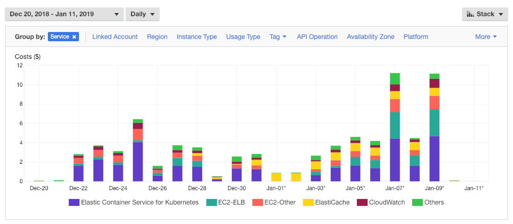

# Performance, Cost, and Design Considerations
This is a test driver for collecting the end-to-end response time of the eligibility orchestrator.

## Build and run benchmark test
```bash
make build
./test.sh
```
The test script uses `ssh` to run tests on the bastion host, although you may also run the test from you local PC, e.g., for mac,
```bash
./perf-mac -debug
```
Or print out more info about how to use the performance test driver.
```bash
./perf-mac -help
```

## Performance test result


This result shows that average response time of this service is 77-98 ms. The system scales linearly as the test driver increases message rate by using more threads.  Thus it can process at a rate of 500 message/s or more, as shown by the test case with 50 client threads.

The last 5 rows in the above table display the sample response time of individual components.  It shows that the org-status service is the major bottleneck of the overall system.  The orchestrator calls the first 3 services in parallel, i.e., Kafka publisher for request message, org-status service, and coverage service. The slowest service of the 3 will determine the response time of the  end-to-end process.

The org-status service is significantly slower than the coverage service because it calls 2 lambda functions sequencially, i.e., the Redis cache first and then the flogo rules.  The response time of each lambda invocation is not very predictable, it ranges from 25 to 100+ ms.  Thus, each additional lambda function may add up to 100 ms delay, although the actual process in each lambda function takes only less than 2 ms.

Although we may improve the performance of this POC further by combining the flogo-rules with the flogo process for org-status, we kept these 2 processes as separate lambda functions to demostrate the overhead of multiple lambda invocations.

## AWS cost for development and test

AWS is a nice cloud environment that removes the burden of infrastructure management from application developers. However, it also creates a new concern that application architects and developers must consider.  That is the cost of production in the public cloud environment.  Following chart shows the various AWS charges during the development and test of this POC.



Performance tests are done on Jan 7 and Jan 9 when we launched the following processes:
- 3 EC2 instances of type t2.medium in an EKS cluster
- 1 EC2 instance of type t2.medium as a bastion host
- 1 ElastiCache for Redis instance with node type cache.t2.small
- Deploy 3 Kafka brokers on the EKS cluster
- Deploy 3 containers for the coverage service on the EKS cluster
- Create 4 ELBs (AWS Elastic Load Balancer) for Kafka brokers (one for each broker, and one more for external broker endpoint)
- Create 1 ELB as external endpoint for the coverage service

During the days of performance tests, the major AWS costs are as follows.
- EKS: This is the major expense charged when EKS cluster is up because we use CloudFormation stacks to create the cluster.  We could avoid this charge if we do not use CloudFormation, but instead, use [KOPS](https://github.com/kubernetes/kops) to manage our own Kubernetes clusters.
- EC2-ELB: This is a major expense for the 5 ELBs created for Kafka and the Coverage service.
- EC2-Other: Not sure what contributes to this charge.
- ElastiCache: This is charged whenever the Redis cache is up.  This POC uses only very minimal cache.  It would be much more expensive when the size and load of the cache increases in production.
- CloudWatch: This is charged for the logs of lambda functions.
- Others: This mainly includes EC2-Instances and CloudTrail. CloudTrail is a charge for AWS account management. The EC2-Instances would be much more expensive when we use more powerful EC2 instances in production.

## Application design considerations

This POC is implemented by use of 6 synchronous microservices that are called sequentially or in parallel.  5 of the services are deployed as AWS Lambda functions, and the other service is deployed in EKS containers.  Service endpoints are exposed by one of the following 3 ways:
- Direct access via ARN of lambda function 
- AWS Elastic Load Balancer
- Amazon API Gateway for REST

The POC demonstrated a successful implementation with good enough performance statistics.  It also exposed a few issues that should be considered in application architecture and design.  We summarize these issues as follows.

### Configure lambda function endpoints

When [SAM CLI](https://docs.aws.amazon.com/serverless-application-model/latest/developerguide/serverless-sam-reference.html) is used to create a CloudFormation stack and deploy lambda functions, the ARN of a lambda function is dynamically generated and appended with a random number, e.g., `arn:aws:lambda:us-west-2:742759186184:function:org-reference-app-OrgdataFunction-1JUY5P3Q21IVK`. Since it may change when the lambda function is re-deployed, the ARN may not be good to use for direct lambda invocation.  The alternative of using its proxy endpoint of API gateway is not acceptable for this POC, either, because the gateway proxy adds 50-100 ms delay to each lambda invocation.

It would not be an issue if we use `AWS CLI` to deploy lambda functions directly, i.e.,
```
aws lambda create-function --function-name my_lambda
```

### Using managed service vs. Managing your own service

We considered Amazon MSK (Managed Streaming for Kafka) for the messaging requirement of this POC.  However, MSK is currently available only in `us-east-1` region, and it would add more costs to the POC.  Since we already have to create an EKS cluster to host the coverage service, we decided to manage our own Kafka brokers on the same EKS cluster.  However, we had to use ELBs to expose the Kafka broker endpoints, which added more costs to our AWS expense. Thus, this approach did not save much money for us, although it gives us more freedom to host the Kafka service in any AWS regions.

We used the Amazon managed ElastiCache for Redis to provide cache for the reference data in this POC.  The ElastiCache is relatively cheap because of the small size and load of this POC.  For larger production data volume and rate of access, the total cost may become a factor of concern.

We used [eksctl](https://github.com/weaveworks/eksctl) to create CloudFormation stacks and EKS cluster.  It is a very convenient way to create EKS cluster.  However, it added costs for the use of EKS.  An alternative approach is to use [KOPS](https://github.com/kubernetes/kops) to create Kubernetes cluster on EC2 directly.  KOPS does not use the AWS EKS service, and thus it could reduce the AWS expense by as much as 40-50%, considering the fact that the extra AWS charge for EKS is almost the same as the charge for actual EC2 workers.

### Synchronous vs. Asynchronous

For many years, application architects often have to decide whether to implement sequence of synchronous APIs, or use asynchronous messaging to decouple components/services in an event-driven architecture.

TIBCO is a pioneer of asynchronous messaging, and has been the most persistent leader on event-driven application architecture.  The asynchronous application pattern has been widely used, and is also very important in the new world of cloud and serverless.  Even for scenario of synchronous request-response, it can be beneficial to implement using asynchronous techniques internally.  For example, [node.js](https://nodejs.org/en/docs/guides/blocking-vs-non-blocking/) uses mostly asynchronous non-blocking calls, and it fundamentally discourages synchronous blocking calls, although JavaScripts are mostly used to implement request-response type of web applications.

For lambda functions, the asynchronous application pattern could be more important than co-located container services, because it involves considerations of both throughput and expenses.  In an application that chains multiple lambda function calls, each call would add 50-100 ms delay.  The calling service will have to wait for the response of called services, and Amazon would charge you for the idle wait time.  Therefore, the application of asynchronous pattern would not only increase the overall throughput, but also could significantly reduce your spending on AWS.

When you use asynchronous event-driven architecture, the response time and throughput of the application would depend on a fast and reliable messaging layer.  The [TIBCO FTL](https://www.tibco.com/products/tibco-ftl) is designed for such very low-latency messages, and thus it is worth to test out.

### AWS app mesh

[AWS App Mesh](https://docs.aws.amazon.com/app-mesh/latest/userguide/what-is-app-mesh.html) is currently in public review, and it is based on [Envoy proxy](https://www.envoyproxy.io/) to help monitor and control containerized microservices deployed on AWS ECS, EKS, or Kubernetes on EC2.  Note that this public review does not mention lambda functions, although the underneath Envoy proxy can route any synchronous or asynchronous TCP communications between microservices, and decouple the service endpoints from network transports.

It is interesting to note the similarity of the design principles between Envoy and TIBCO FTL.  They both have a goal to improve the portability by decoupling service endpoints from network transports, although FTL solve the problem for messaging, while Envoy is targeting HTTP services.

Without use of the AWS app mesh, this POC used API gateway and ELBs to route requests to target service instances.  This approach achieves similar goals as the app mesh, although API proxy and ELBs are Level-7 routers, and they may not have advanced capabilities for monitoring and service discovery that the future AWS App Mesh may provide.

### Summary

- Managed services may or may not be the most cost-effective way to deploy applications in Amazon. Sometimes you may achieve significant cost saving if you can bypass services such as EKS. Besides, for service that is not yet available as a managed service, such as TIBCO FTL, its significant benefits in high-performance and low-latency may make it worth to manage by yourself.
- Asynchronous application pattern may significantly improve the scalability and throughput, and reduce the AWS hosting cost by removing the idle wait time in a synchronous request/reply scenario.  It is especially more important to apply the asynchronous pattern when an application depends on a third-party service whose response time is unpredictable.
- AWS App Mesh may be used to improve the monitoring and dynamic service discovery in the future when it becomes more mature. At present, however, AWS API proxy gateway and ELB can serve similar purposes. 